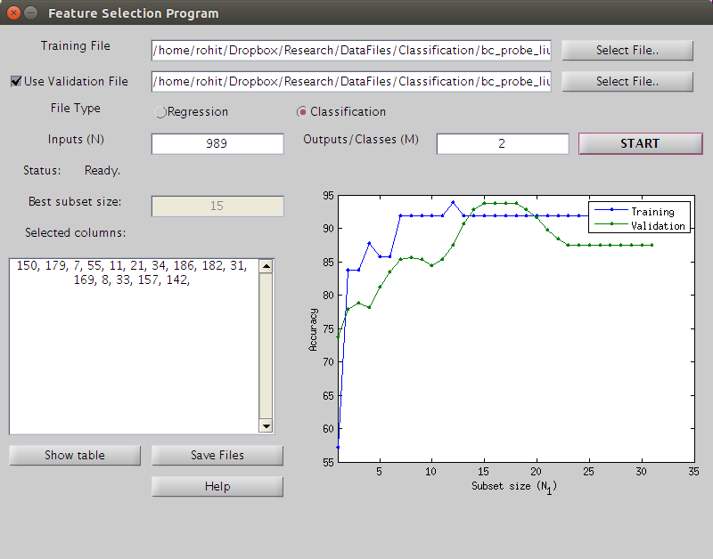
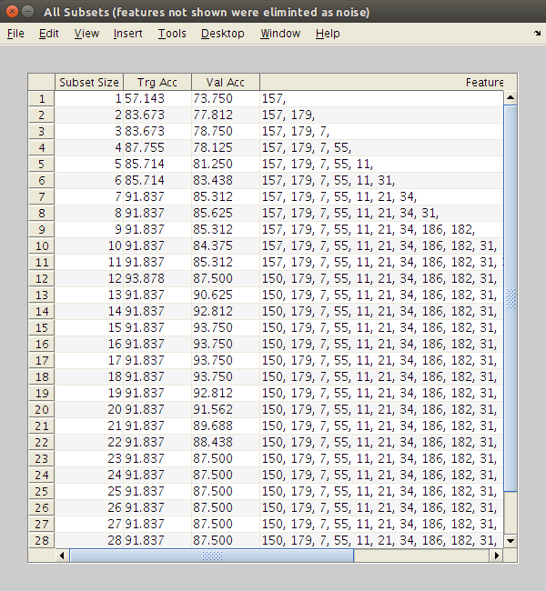
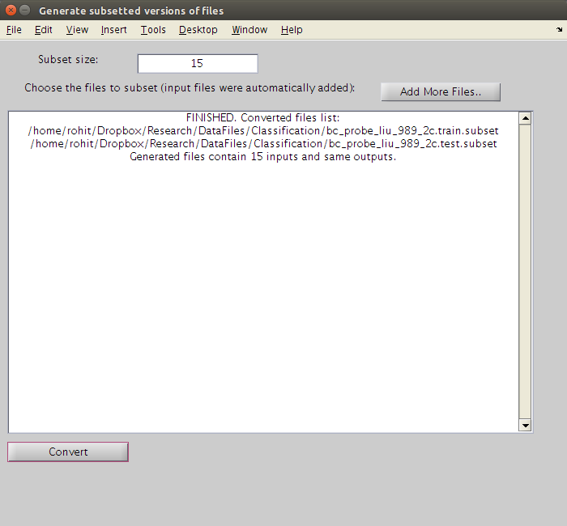

Feature Selection Program
=========================

Image Processing and Neural Networks Lab, 
The University of Texas at Arlington.  
[http://www.uta.edu/faculty/manry/](http://www.uta.edu/faculty/manry/)  

*Algorithm*: 2-stage feature selection with PLNs

*Author*: Rohit Rawat  
Floating Search code from Dr Jiang Li

This program eliminates useless feature from a data file and produces a 
subset of features with the best validation error found using 
floating search.

Data File Format
----------------

### Approximation case

The training data has N inputs x and M outputs t. Patterns are arranged in rows
with a tab or space separating the elements.

x_1 x_2 ... x_N t_1 t_2 ... t_M

Example data file with N = 4, M = 2

    0.8147    0.0975    0.1576    0.1419    0.6557    0.7577  
    0.9058    0.2785    0.9706    0.4218    0.0357    0.7431  
    0.1270    0.5469    0.9572    0.9157    0.8491    0.3922  
    0.9134    0.9575    0.4854    0.7922    0.9340    0.6555  
    0.6324    0.9649    0.8003    0.9595    0.6787    0.1712  

The first four columns are the inputs and the last two columns are the outputs.

### Classification case

The training data has N inputs x and M classes ic. Patterns are arranged in rows
with a tab or space separating the elements. The class numbers ic must start 
from 1, going all the way to M.

x_1 x_2 ... x_N ic

Example data file with N = 4, Nc = 2

    0.6020    0.0838    0.9961    0.7749    2.0000  
    0.2630    0.2290    0.0782    0.8173    1.0000  
    0.6541    0.9133    0.4427    0.8687    2.0000  
    0.6892    0.1524    0.1067    0.0844    2.0000  
    0.7482    0.8258    0.9619    0.3998    1.0000  
    0.4505    0.5383    0.0046    0.2599    1.0000  

The first four columns are the inputs and the last column has the class numbers.

Validation data
---------------
This program uses validation data for network sizing. If you have already split
your data into training and validation files, supply both files to the program.
If you did not, the program can automatically split the training file to
generate validation data.

Other inputs
------------
N: inputs, M: outputs

Running the GUI
---------------
Run the program: "start.m"
Configure all the parameters in the GUI and press the "Start" button.
The results are displayed in the window. The final feature subset is also
stored in the file 'final_feature_order.txt'.

You can press the Show Table button to see all feature subsets that were generated.

You can press the Save Files button to save the selected feature from 
original data files into new data files. More files can be added to the 
list to perform the same operation on them.

README version 1

Rohit Rawat 02/5/2016

